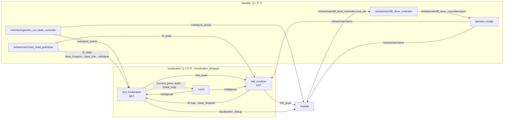
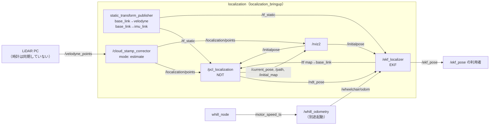
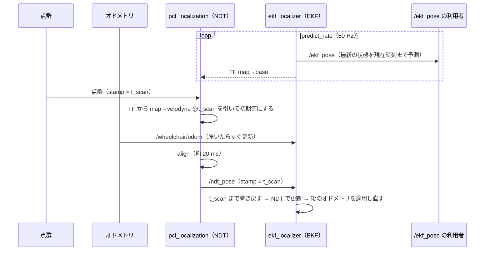

# ノード間通信

`localization.launch.py` で起動したときのノード・トピック・TF のつながりです。
`env:=gazebo` は動作を確認済みです。`env:=real` は設定ファイルから書いたもので、実機ではまだ確認していません。

## Gazebo（`env:=gazebo`）

- 時刻：Gazebo が配信する `/clock`（100 Hz）に、localization の全ノードが従います（`use_sim_time: true`）。図では省略しています。
- 点群の stamp：sim time でそろっているので、補正しません（`cloud_stamp_correction: none`）。
- 通信：localization コンテナ、Gazebo コンテナ、MATLAB の 3 つとも、同じ Fast DDS プロファイル（`fastdds_localhost.xml`）で localhost だけで通信します。LAN 上の他の ROS 2 とはつながりません。

## 実機（`env:=real`）

- 時刻：この PC の時計です。点群は別の PC が stamp を付けるので、`cloud_stamp_corrector` がこの PC の時計に直してから NDT に渡します。
- 取付：launch が `real.yaml` の `static_tfs` を静的 TF として配信します。
- 通信：LiDAR PC と LAN 越しに通信するので、localhost だけに絞るプロファイルは使いません。

## 処理の流れ（NDT の遅れと巻き戻し）

- EKF は、観測とそのときの状態を `history_length`（1.0 秒）分だけ保持します。これより古い `/ndt_pose` は捨てて WARN を出します。
- NDT が TF を引けないとき（EKF の初期化前、`/initialpose` を受けた直後の 1 秒間）は、前回の NDT の解か、与えられた初期姿勢を初期値にします。

## トピック

| トピック | 型 | 配信 | 購読 | QoS | 周期 | 内容 |
|---|---|---|---|---|---|---|
| `/velodyne_points` | `sensor_msgs/PointCloud2` | Gazebo / LiDAR PC | NDT（Gazebo）、`cloud_stamp_corrector`（実機）、MATLAB | NDT 側は best effort、KeepLast(1) | 10 Hz | 点群 |
| `/localization/points` | `sensor_msgs/PointCloud2` | `cloud_stamp_corrector` | NDT、RViz | reliable、KeepLast(1) | 10 Hz | stamp をこの PC の時計に直した点群（実機のみ） |
| `/wheelchair/odom` | `nav_msgs/Odometry` | `gazebo_bridge` / `whill_odometry` | EKF、MATLAB | EKF 側は best effort、KeepLast(50) | 50 Hz（Gazebo） | 使うのは `twist.linear.x`（v）と `twist.angular.z`（omega） |
| `/ndt_pose` | `geometry_msgs/PoseWithCovarianceStamped` | NDT | EKF | reliable、KeepLast(10) | 約 10 Hz | NDT の解。map → LiDAR、stamp は点群の取得時刻 |
| `/ekf_pose` | `geometry_msgs/PoseWithCovarianceStamped` | EKF | MATLAB | reliable、transient_local、KeepLast(1) | 50 Hz | EKF の推定。map → LiDAR、stamp は現在時刻 |
| `/ekf_odom` | `nav_msgs/Odometry` | EKF | （なし） | reliable、KeepLast(10) | 50 Hz | map → base の姿勢と、base 座標での v・omega |
| `/current_pose` | `geometry_msgs/PoseWithCovarianceStamped` | NDT（`pcl_pose` をリマップ） | RViz | reliable、transient_local、KeepLast(1) | 約 10 Hz | NDT の解。`pose_output_frame: "lidar"` なので map → LiDAR |
| `/path` | `nav_msgs/Path` | NDT | RViz | reliable、transient_local、KeepLast(1) | 約 10 Hz | NDT の解（base）の軌跡 |
| `/initial_map` | `sensor_msgs/PointCloud2` | NDT | RViz | reliable、transient_local、KeepLast(1) | 起動時 1 回 | 読み込んだ PCD 地図 |
| `/localization_debug` | `std_msgs/Float32MultiArray` | NDT | MATLAB | reliable、transient_local、KeepLast(1) | 約 10 Hz | [点数, align 時間 s, 収束, fitness, 初期値との角度差 deg] |
| `/initialpose` | `geometry_msgs/PoseWithCovarianceStamped` | RViz（2D Pose Estimate） | NDT、EKF | system default | 手動 | NDT は初期姿勢を置き換え、EKF はリセットして次の NDT で初期化し直す |

## TF

| 変換 | 配信 | 使うノード |
|---|---|---|
| map → base（Gazebo：`base_footprint`、実機：`base_link`） | EKF（50 Hz） | NDT（点群の取得時刻の値を初期値に使う）、RViz |
| `base_footprint` → `base_link` → `velodyne_base_link` → `velodyne` | `robot_state_publisher`（URDF、Gazebo） | NDT・EKF（base → LiDAR の取付として読む） |
| `base_link` → `velodyne`、`base_link` → `imu_link` | launch の `static_transform_publisher`（実機） | NDT・EKF（同上） |

`use_ekf:=false` で起動したときは EKF が起動しないので、map → base は NDT が配信し、`/ndt_pose` を購読するノードはなくなります。
